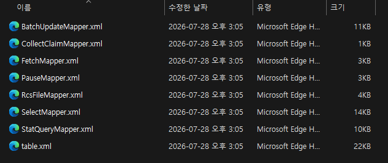

# 2-2. config/mapper 폴더 — 매퍼 외부화

운영 중 SQL 쿼리(메시지 조회, 통계, INSERT 등)를 변경해야 할 때 jar 재빌드 없이 외부 폴더의 **XML 만 수정**하면 됩니다. **변경 후 재시작**이 필요합니다.

<figure><figcaption><p>그림 4. config/mapper/{dbms}/ 구성</p></figcaption></figure>

DBMS별 폴더 안에 8종의 매퍼 파일이 있습니다.

<figure><figcaption><p>그림 5. DBMS 폴더 내부 매퍼 파일 8종</p></figcaption></figure>

<table><thead><tr><th width="298">파일</th><th>역할</th></tr></thead><tbody><tr><td><strong><code>BatchUpdateMapper.xml</code></strong></td><td>발송 중→ 발송 완료 상태 갱신 쿼리</td></tr><tr><td><strong><code>CollectClaimMapper.xml</code></strong></td><td>발송 대기 → 발송 중 상태 갱신 쿼리</td></tr><tr><td><strong><code>FetchMapper.xml</code></strong></td><td>발송 완료 메시지 log 이관 및 삭제</td></tr><tr><td><strong><code>PauseMapper.xml</code></strong></td><td>발송 중단 상태 모니터링 쿼리</td></tr><tr><td><strong><code>RcsFileMapper.xml</code></strong></td><td> RCS MMS — 업로드 된 파일 조회 및 저장 쿼리</td></tr><tr><td><strong><code>SelectMapper.xml</code></strong></td><td>메시지 조회 쿼리</td></tr><tr><td><strong><code>StatQueryMapper.xml</code></strong></td><td>모니터링 통계 쿼리</td></tr><tr><td><strong><code>table.xml</code></strong></td><td>테이블 자동 생성 DDL</td></tr></tbody></table>

### **동작 원리**

Odyssey는 시작 시 매퍼를 외부화하여 로드합니다. (**외부 매퍼** — <mark style="color:red;">**`./config/mapper/{dbms}/*.xml`**</mark> 사용)

시작 로그에서 어느 DBMS가 사용 중인지 확인할 수 있습니다.

```
# 예시
INFO  [main] c.m.pipeline.config.TenantDBConfig - Detected DBMS type : mysql
INFO  [main] com.zaxxer.hikari.HikariDataSource - COLLECT-HikariCP - Starting...
INFO  [main] com.zaxxer.hikari.pool.HikariPool - COLLECT-HikariCP - Added connection com.mysql.cj.jdbc.ConnectionImpl@4d2f9e3c
INFO  [main] com.zaxxer.hikari.HikariDataSource - COLLECT-HikariCP - Start completed.
```

### **매퍼 수정 워크플로우**

```bash
# 1. 매퍼 수정
vi config/mapper/mysql/selectMapper.xml

# 2. 재시작 (변경사항 반영)
./stop.sh
./start.sh
```


핫 리로드는 지원하지 않습니다. 변경 후 반드시 재시작하세요.



XML 문법 오류가 있으면 기동에 실패합니다. 변경 후 반드시 시작 로그에서 매퍼 로드 결과를 확인하세요.

