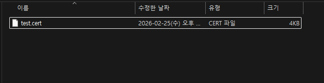

# 2-3. auth 폴더

<figure><figcaption>
그림 6. auth 폴더 내부 (.cert 인증파일)
</figcaption></figure>

KT 크로샷 세션 인증파일(<mark style="color:red;">**`.cert`**</mark>)을 보관합니다. 세션마다 다른 파일이 들어가며, 파일명은 <mark style="color:red;">`application-HA.yaml`</mark>의 <mark style="color:red;">`kt.sessions[].auth-file`</mark> 값과 정확히 일치해야 합니다.


<mark style="color:red;">**`.cert`**</mark> 파일은 대소문자를 구분합니다. Linux 환경에서 특히 주의하세요.


