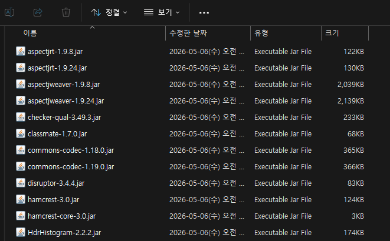

# 2-4. lib 폴더 — 외부 라이브러리

<figure><figcaption><p>그림 7. lib 폴더 내부 (외부 라이브러리 약 130개)</p></figcaption></figure>

Spring Boot, JDBC 드라이버, Netty 등 모든 외부 라이브러리가 들어있습니다. (약 130개 <mark style="color:red;">`.jar`</mark>)

<mark style="color:red;">**`start.sh`**</mark> 가 <mark style="color:red;">`-cp "lib/*"`</mark> 와일드카드로 자동 인식합니다.

### **DB 드라이버 교체 시나리오**

고객사 DB가 MySQL 5.x인 경우, 기본 동봉된 드라이버를 5.x용으로 교체할 수 있습니다.

```bash
# 1. 기본 드라이버 제거
cd /path/to/odyssey/lib
rm mysql-connector-j-*.jar

# 2. 호환 드라이버 추가
cp /tmp/mysql-connector-java-5.1.49.jar lib/

# 3. 재시작
./stop.sh
./start.sh multi
```


**드라이버 교체 시 yaml 파일도 함께 확인**해야 합니다. <mark style="color:red;">**`driver-class-name`**</mark> 과 <mark style="color:red;">**`jdbc-url`**</mark> 옵션이 버전마다 다릅니다. (아래 표 참고)


<table><thead><tr><th width="181">항목</th><th>MySQL 8.x</th><th>MySQL 5.x</th></tr></thead><tbody><tr><td><strong><code>driver-class-name</code></strong></td><td><mark style="color:red;"><code>com.mysql.cj.jdbc.Driver</code></mark></td><td><mark style="color:red;"><code>com.mysql.jdbc.Driver</code></mark></td></tr><tr><td><strong><code>jdbc-url</code></strong> 옵션</td><td><code>useSSL=false&#x26;allowPublicKeyRetrieval=true</code></td><td><code>useSSL=false&#x26;serverTimezone=Asia/Seoul</code> 등</td></tr></tbody></table>

다른 DBMS 드라이버(<mark style="color:red;">`postgresql-*.jar`</mark>, <mark style="color:red;">`mssql-jdbc-*.jar`</mark>, <mark style="color:red;">`mariadb-java-client-*.jar`</mark>, <mark style="color:red;">`ojdbc11-*.jar`</mark>)도 동일한 방식으로 교체할 수 있습니다.


**`lib/`** 안에는 **외부 라이브러리만** 들어있습니다. <mark style="color:red;">`odyssey-app-*.jar`</mark>, <mark style="color:red;">`odyssey-pipeline-*.jar`</mark> 같은 자사 코드는 **패키지 루트**에 위치하며, 임의로 변경하지 마세요.

