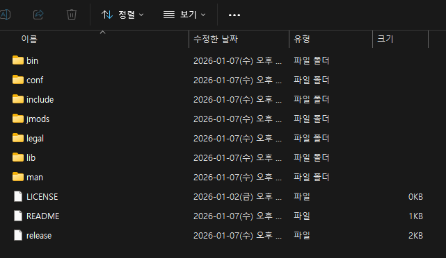

# 2-5. jre 폴더 — 번들 JRE

<figure><figcaption><p>그림 8. jre 폴더 내부 (Java 21 LTS 번들)</p></figcaption></figure>

자체 동봉된 **Java 21 LTS** JRE 입니다. 기본적으로 Odyssey는 시스템에 설치된 자바와 **무관하게** 이 폴더의 JRE만으로 동작하며, 고객사가 Java 21 을 자체 운영하는 환경이라면 jre 폴더를 제거하여 시스템 Java 로 전환할 수도 있습니다.

### **1. Java 결정 우선순위**

<mark style="color:red;">**`start.sh`**</mark> 는 기동 시 다음 순서로 사용할 Java 를 결정합니다.

<table><thead><tr><th width="86">순위</th><th width="369">조건</th><th>사용 Java</th></tr></thead><tbody><tr><td>1</td><td><strong><code>./jre/</code></strong> 폴더 존재 + <mark style="color:red;"><code>./jre/bin/java</code></mark> 실행 가능</td><td><strong>번들 JRE</strong> (<mark style="color:red;"><code>./jre/bin/java</code></mark>)</td></tr><tr><td>2</td><td><strong><code>./jre/</code></strong> 폴더 없음 + 시스템 PATH 에 <mark style="color:red;"><code>java</code></mark> 존재</td><td><strong>시스템 Java</strong> (<mark style="color:red;"><code>java</code></mark>)</td></tr><tr><td>실패</td><td>둘 다 없음 또는 Java 21 미만</td><td>기동 거부 + 에러 안내</td></tr></tbody></table>

시작 시 다음과 같은 INFO 로그로 어느 Java 가 선택됐는지 확인할 수 있습니다.

```
# 번들 JRE 사용 시
INFO Java: ./jre/bin/java (bundled JRE (./jre))

# 시스템 Java 사용 시
INFO Java: java (system Java (PATH))
```

### **2. 시스템 Java 사용 운영 패턴**

고객사가 자체 Java 21 운영을 원하는 경우:

```bash
# 패키지에서 jre 폴더만 제거 (다른 폴더 그대로)
rm -rf jre/

# 시스템 Java 21 확인
java -version
# → openjdk version "21.0.x" ... 또는 동등 버전

# 그대로 기동 — start.sh 가 시스템 Java 자동 사용
./start.sh
```


시스템 Java 사용 시에도 **Java 21 이상이 필수**입니다 (Spring Boot 3.5.x 최소 요구사항). 미만 버전이면 <mark style="color:red;">`start.sh`</mark> 가 명확한 에러 메시지로 기동을 거부합니다.


### **3. 검증 명령**

```bash
# 번들 JRE 버전 확인 (jre/ 동봉 환경)
./jre/bin/java -version
# → openjdk version "21.0.x" ...  (Linux x64)

# 실행 중인 프로세스가 어느 Java 로 떠 있는지 확인
ps -ef | grep odyssey
# → 번들 사용 시: 명령줄에 ./jre/bin/java 절대경로
# → 시스템 사용 시: 명령줄에 java (PATH 에서 해석됨)
```

### **4. 첫 실행 전 — Linux 측 실행 비트 복원**

패키지 전송 방식(scp, zip 압축 등)에 따라 실행 비트가 손실 될 수 있습니다. 첫 실행 전 한 번 복원합니다.

```bash
chmod -R +x jre/bin start.sh stop.sh
```


번들 JRE는 OS별 다른 빌드입니다 — Linux 패키지에는 Linux x64 (glibc), Windows 패키지에는 Windows x64 (PE32+) 가 동봉됩니다. 폴더명(**`jre/`**)은 동일하지만 내부 바이너리는 OS 전용이라 서로 호환되지 않습니다.

