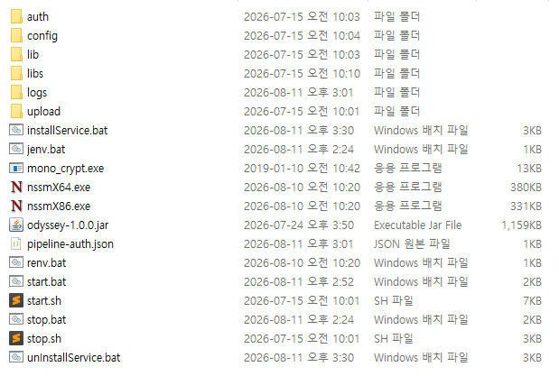

# 2.패키지 구성

Odyssey는 **자립형 배포 패키지**로 구성됩니다. 시스템 자바, DB 드라이버, 매퍼 쿼리 등 운영 시 자주 바뀌는 영역을 외부 폴더로 분리해, jar 재빌드 없이 운영 환경에서 직접 변경할 수 있습니다.

## <mark style="color:$primary;">**패키지 폴더 구조**</mark> 

<figure><figcaption>
01. 배포 패키지 구성
</figcaption></figure>

### **공통 항목**

<table><thead><tr><th width="261">항목</th><th>설명</th></tr></thead><tbody><tr><td><strong><code>odyssey-1.0.0.jar</code></strong></td><td>자사 코드 (thin jar — 외부 <strong><code>lib/</code></strong> 와 함께 동작)</td></tr><tr><td><strong><code>lib/</code></strong></td><td>외부 라이브러리 폴더 — Spring Boot, JDBC 드라이버, Netty 등 (<a href="2-4.-lib.md">2-4. lib폴더 — 외부라이브러리</a> 참고)</td></tr><tr><td><strong><code>libs/</code></strong></td><td>운영 모니터링 네이티브 라이브러리 폴더 — <mark style="color:red;"><code>cypher.dll</code></mark>(Windows) / <mark style="color:red;"><code>libcypher.so</code></mark>(Linux) (<a href="2-7.-libs.md">2-7. libs 폴더 — 네이티브 모니터링 라이브러리</a> 참고)</td></tr><tr><td><strong><code>jre/</code></strong></td><td>번들 Java 21 JRE — <strong>시스템 자바와 무관</strong>하게 동작 (<a href="2-5.-jre-jre.md">2-5. jre 폴더 — 번들 JRE</a> 참고)</td></tr><tr><td><strong><code>config/</code></strong></td><td>환경 설정 폴더 — <mark style="color:red;"><code>application.yml</code>, <code>ha.properties</code></mark>, <mark style="color:red;"><code>mapper/</code></mark> 등 (<a href="2-1.-config.md">2-1. config 폴더</a>, <a href="2-2.-config-mapper.md">2-2. config/mapper 폴더 — 매퍼 외부화</a> 참고)</td></tr><tr><td><strong><code>auth/</code></strong></td><td>KT 크로샷 세션 인증파일(<mark style="color:red;"><code>.cert</code></mark>) 폴더 (<a href="2-3.-auth.md">2-3. auth 폴더</a> 참고)</td></tr><tr><td><strong><code>upload/</code></strong></td><td>RCS, MMS, VMS 첨부 파일 폴더</td></tr><tr><td><strong><code>logs/</code></strong> (자동 생성)</td><td>
실행 로그 폴더
<ul><li><strong><code>live/</code></strong> — <mark style="color:red;"><code>system.log</code></mark>(전체 로그), <mark style="color:red;"><code>error.log</code></mark>, <mark style="color:red;"><code>router.log</code></mark> 등 모듈 별 파일</li><li><strong><code>odyssey-pipeline.out</code></strong> — JVM 콘솔 안전망 - Spring 부트 init, JVM 크래시 등 logback이 못 잡는 출력</li></ul></td></tr><tr><td><strong><code>pids/</code></strong> (자동 생성)</td><td>실행 중 프로세스 PID 파일 폴더</td></tr><tr><td><strong><code>log_backup/</code></strong> (자동 생성)</td><td>일자 별 압축 로그 백업, <strong><code>logs/live/*.log</code></strong> 50MB 이상 축적 시 백업</td></tr><tr><td><strong><code>backup/</code></strong> (자동 생성)</td><td>Web UI 설정 변경 백업</td></tr><tr><td><strong><code>pipeline-auth.json</code></strong> (자동 생성)</td><td>서비스 실행 시 자동 생성</td></tr></tbody></table>


**`libs/`** 의 자사 코드 jar 는 본체만 포함된 작은 파일(수백 KB)이며, 실제 의존 라이브러리는 외부 **`lib/`** 폴더에서 로딩 됩니다. 드라이버 등 라이브러리 교체 시 **jar 재빌드 없이 `lib/` 안의 jar 만 교체**하면 됩니다.


### <mark style="color:$primary;">**Linux / Windows OS 전용 파일 구분**</mark> 

<table><thead><tr><th width="130">OS</th><th width="250">산출물</th><th>OS 전용 추가 파일</th></tr></thead><tbody><tr><td><strong>Linux</strong></td><td><mark style="color:red;"><code>odyssey-linux-1.0.0.zip</code></mark></td><td><code>start.sh</code> / <code>stop.sh</code></td></tr><tr><td><strong>Windows</strong></td><td><mark style="color:red;"><code>odyssey-windows-1.0.0.zip</code></mark></td><td><code>start.bat</code> / <code>stop.bat</code> / <code>installService.bat</code> / <code>unInstallService.bat</code> / <code>jenv.bat</code> / <code>renv.bat</code> / <code>nssmX64.exe</code> / <code>nssmX86.exe</code></td></tr></tbody></table>

#### **Linux 전용**

<table><thead><tr><th width="197">항목</th><th>설명</th></tr></thead><tbody><tr><td><strong><code>start.sh</code></strong> / <strong><code>stop.sh</code></strong></td><td>시작 / 종료 스크립트 (<a href="../4.-start-stop.md">4. 실행 / 정지</a> 참고)</td></tr></tbody></table>

#### **Windows 전용**

<table><thead><tr><th width="246">항목</th><th>설명</th></tr></thead><tbody><tr><td><strong><code>start.bat</code></strong> / <strong><code>stop.bat</code></strong></td><td>수동 실행 / 종료 스크립트 — 더블 클릭 또는 cmd 에서 실행 ( <a href="2-6.-windows.md">2-6. Windows 전용 파일</a> 참고)</td></tr><tr><td><strong><code>installService.bat</code></strong> / <strong><code>unInstallService.bat</code></strong></td><td>Windows 서비스 등록 / 해제 — 24/7 운영 시 사용</td></tr><tr><td><strong><code>jenv.bat</code></strong> / <strong><code>renv.bat</code></strong></td><td>서비스 실행 시 필요한 내부 환경 변수 로드 및 세팅</td></tr><tr><td><strong><code>nssmX64.exe</code></strong> / <strong><code>nssmX86.exe</code></strong></td><td>Windows 운영체제 용 실행 파일</td></tr></tbody></table>
