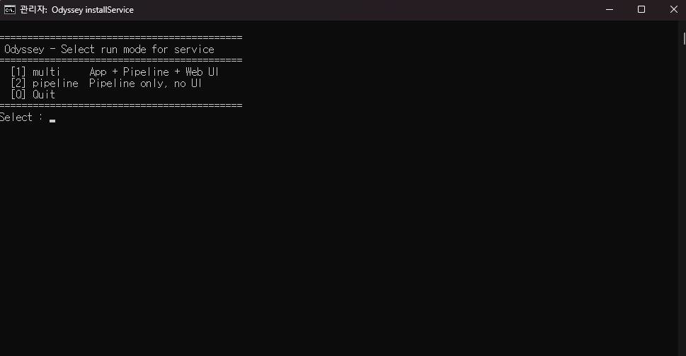

# 4. 실행 / 정지

배포 패키지에는 사전 빌드된 thin jar(<mark style="color:red;">`odyssey-1.0.0.jar`</mark>)와 번들 JRE(**`jre/`**), 외부 라이브러리(**`lib/`**)가 포함되어 있어, 별도 빌드 없이 바로 기동할 수 있습니다.

## 1. Linux <a href="#linux" id="linux"></a>

Odyssey 설치 폴더에서 다음 명령을 실행합니다.

<mark style="color:red;">`start.sh`</mark> 는 자동으로 적절한 Java 를 선택하고(**`jre/`** 동봉 시 번들 JRE, 미동봉 시 시스템 Java 21) 외부 **`lib/`** 를 classpath 와일드카드로 인식합니다.

— 운영자가 별도로 설정할 것은 없습니다. ([2-5. jre 폴더 — 번들 JRE](2.-package/2-5.-jre-jre.md) 참고)

```bash
# 시작
./start.sh

# 정지 (graceful, 최대 30초 대기)
./stop.sh

# 강제 정지
./stop.sh all force
```


첫 실행 전 한 번만 실행 비트 복원: <mark style="color:green;">**`chmod +x start.sh stop.sh`**</mark> (번들 JRE 동봉 시 `chmod -R +x jre/bin` 도 함께 실행)


## 2. Windows <a href="#windows" id="windows"></a>

Windows 패키지는 두 가지 운영 모드를 제공합니다.

— **수동 실행** (테스트/임시) 과 **Windows 서비스 등록** (24/7 운영, 권장).

### 수동 실행

cmd 또는 탐색기 더블클릭으로 실행. 사용자 로그인 세션에 묶여 있어 **로그아웃 시 종료**됩니다.

```cmd
start.bat                    
stop.bat                     
```

### Windows 서비스 등록 (24/7 운영)

<mark style="color:red;">`installService.bat`</mark> 더블클릭(또는 cmd 실행) → UAC 권한 자동 요청 → 메뉴에서 모드 선택 → **서비스 등록 + 시작 한 번에 처리** (부팅 시 자동 시작 + 죽으면 자동 재시작 + **사용자 로그아웃 무관 동작**)

<figure><figcaption><p>그림 09. installService.bat 실행</p></figcaption></figure>

```cmd
installService.bat           :: 서비스 자동 등록 + 실행
unInstallService.bat         :: 서비스 정지 + 등록 해제
```

### 등록 후 운영

```cmd
sc query Odyssey             :: 상태 확인
net stop Odyssey             :: 정지
net start Odyssey            :: 시작
```

또는 <mark style="color:red;">`services.msc`</mark> 에서 "Odyssey" 항목 우클릭으로 GUI 조작 가능.


수동 모드와 서비스 모드를 **동시에 실행하지 마세요**. (포트/DB 락 충돌)

한 모드만 골라 운영하세요. 설치 경로는 한글/공백 없는 영문(예: **`C:\Odyssey\`**)을 권장합니.


***

## 3. 정상 기동 확인 <a href="#undefined" id="undefined"></a>

`logs/live/`<mark style="color:red;">**`system.log`**</mark>(또는 `log/`<mark style="color:red;">**`odyssey-pipeline.out`**</mark>)에 다음과 유사한 메시지가 출력됩니다.

```
Java: ./jre/bin/java (bundled JRE (./jre))
MyBatis mappers: external [file:./config/mapper/mysql/*.xml] -> 5 files
Database Driver Load Success.
DBMS=[MySQL], URL=jdbc:mysql://**.**.**.**/****
Mono Messaging Service agent=[Odyssey-1.0.0] starts.
Exist Table Name=[ODYSSEY]
Exist Table Name=[ODYSSEY_RCSFILE]
SendKT Thread Start

INFO  [main] c.mono.pipeline.PipelineApplication - Starting PipelineApplication using Java 21.0.11 with PID 17104 (C:\...\odyssey...  started by mono in C:\...\odyssey...)
INFO  [main] c.mono.pipeline.PipelineApplication - No active profile set, falling back to 1 default profile: "default"
INFO  [main] o.s.b.w.e.tomcat.TomcatWebServer - Tomcat initialized with port **** (http)
INFO  [main] o.a.coyote.http11.Http11NioProtocol - Initializing ProtocolHandler ["http-nio-****"]
INFO  [main] o.a.catalina.core.StandardService - Starting service [Tomcat]
INFO  [main] o.a.catalina.core.StandardEngine - Starting Servlet engine: [Apache Tomcat/10.1.46]
INFO  [main] o.a.c.c.C.[Tomcat].[localhost].[/] - Initializing Spring embedded WebApplicationContext
INFO  [main] o.s.b.w.s.c.ServletWebServerApplicationContext - Root WebApplicationContext: initialization completed in 2789 ms
INFO  [main] c.m.pipeline.config.TenantDBConfig - Detected DBMS type : mysql
INFO  [main] com.zaxxer.hikari.HikariDataSource - COLLECT-HikariCP - Starting...
INFO  [main] com.zaxxer.hikari.pool.HikariPool - COLLECT-HikariCP - Added connection com.mysql.cj.jdbc.ConnectionImpl@********
INFO  [main] com.zaxxer.hikari.HikariDataSource - COLLECT-HikariCP - Start completed.
...
INFO  [main] c.m.p.init.PoseidonStartNotifier - Poseidon integration disabled (poseidon.url not configured) — skipping start notification, heartbeat, shutdown signal
```


<mark style="color:$primary;">**시작 로그 핵심**</mark>

* `Starting PipelineApplication using Java ...` - Java 버전 및 종류 확인 ([2-5. jre 폴더 — 번들 JRE](2.-package/2-5.-jre-jre.md) 참고)
* `Detected DBMS type : ...` - 외부 매퍼 정상 로드 ([2-2. config/mapper 폴더 — 매퍼 외부화](2.-package/2-2.-config-mapper.md) 참고)
* `Poseidon integration disabled` - Poseidon 미연동 환경에서만, 정상 ([16. Poseidon 모니터링 연동](../part-2./16.-poseidon/) 참고)

