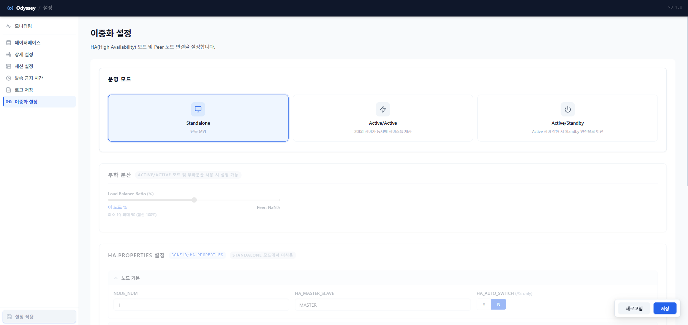
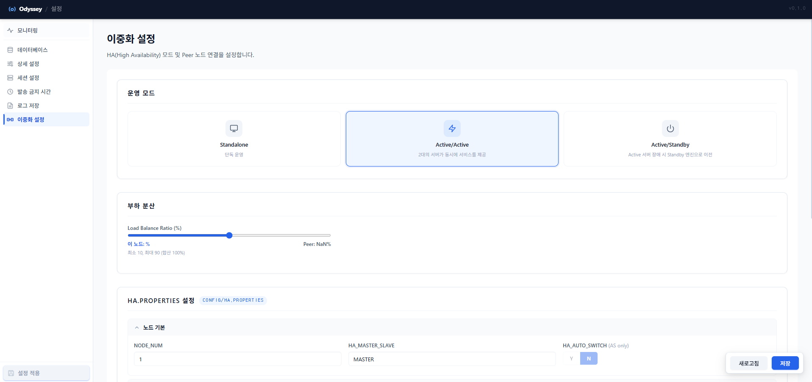
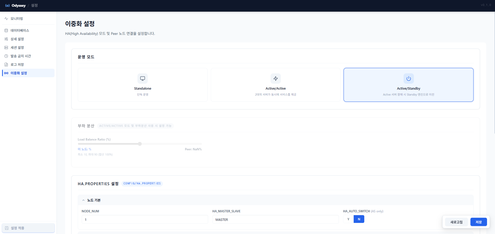

# 20-7. 이중화 설정

HA 운영 모드 선택, 부하 분산, <mark style="color:red;">`ha.properties`</mark> 직접 편집을 한 화면에서 처리합니다.

<table><thead><tr><th width="166.60003662109375">운영 모드</th><th width="275.5999755859375">설명</th><th>부하 분산 / HA.PROPERTIES</th></tr></thead><tbody><tr><td><strong><code>Standalone</code></strong></td><td>단일 노드 운영. 이중화 미사용.</td><td>부하 분산 비활성, <strong>HA.PROPERTIES</strong> 비활성</td></tr><tr><td><strong><code>Active/Active</code></strong></td><td>두 노드가 동시에 메시지를 나눠 발송. 처리량 ↑, 부하 분산.</td><td>부하 분산 활성, <strong>Load Balance Ratio</strong> 조정 가능</td></tr><tr><td><strong><code>Active/Standby</code></strong></td><td><strong>Master</strong> 한 대만 발송, Slave는 대기. 장애 시 자동/수동 전환.</td><td><strong>HA_AUTO_SWITCH</strong> 활성, 부하 분산 비활성</td></tr></tbody></table>

<figure><figcaption>
그림 21. 이중화 설정 — Standalone 모드 (부하 분산 · HA.PROPERTIES 비활성)
</figcaption></figure>

<figure><figcaption>
그림 22. 이중화 설정 — Active/Active 모드 (부하 분산 활성, Load Balance Ratio 조절 가능)
</figcaption></figure>

<figure><figcaption>
그림 23. 이중화 설정 — Active/Standby 모드 (HA_AUTO_SWITCH 활성)
</figcaption></figure>


HA 프로파일로 기동한 경우에만 본 메뉴가 활성화됩니다. AS/SA 프로파일에서는 메뉴가 표시되지 않거나 일부 옵션이 비활성화될 수 있습니다.

