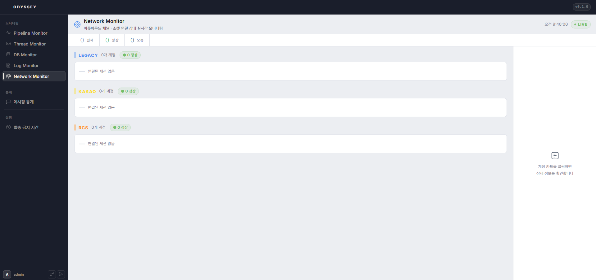

# 20-1. 실시간 모니터링

**Odyssey**의 실시간 발송 상태와 발송 통계를 시각적으로 확인하는 대시보드입니다.

### <mark style="color:blue;">실시간 발송 현황</mark>

* **파이프라인 시각화**: DB 조회 → 전송 대기 → 발송 처리 흐름을 단계 별로 표시합니다.
* **큐 사이즈**: 전송 유형(**legacy/RCS/카카오**)별 대기 건수를 표시합니다.
* **TPS**: 초당 처리 건수(Transactions Per Second)를 실시간으로 표시합니다.
* **CPU / 메모리 사용률**: 원형 게이지로 서버 리소스 사용 현황을 표시합니다.

<figure><figcaption>
그림 10. 모니터링 화면 — 실시간 발송 현황 (파이프라인, 큐 사이즈, TPS, 리소스 게이지)
</figcaption></figure>

### <mark style="color:blue;">JVM 라이브 스레드 현황</mark>

* **스레드 현황 시각화**
* **각 스레드 상태 상세 조회**

<figure><figcaption>
그림 11. 모니터링 화면 — 스레드
</figcaption></figure>

### <mark style="color:$primary;">DB 상태 실시간 모니터링</mark>

* 누적 처리 건수, 처리 지연, 최대 응답 시간 등
* 수집 · 패치 · 결과 리포트 · 통계 **단계 별 DB 연결 현황**
* **처리 지연 순위**: 처리 항목 별 처리 지연 상위 12개 항목

<figure><figcaption>
그림 12. 모니터링 화면 — DB 현황
</figcaption></figure>

### <mark style="color:$primary;">네트워크 환경 실시간 모니터링</mark>

* 메시지 발송 타입 별 각 계정(세션) 연결 상태

<figure><figcaption>
그림 13. 모니터링 화면 — 아웃바운드 채널·소켓 연결
</figcaption></figure>

### <mark style="color:blue;">발송 통계</mark>

일/주/월 단위로 집계된 발송 통계를 차트로 확인하고, 결과를 **CSV·Excel**로 내려받을 수 있습니다.

* **메시지 타입 별 통계**: **legacy / RCS / Kakao** 등 메시지 종류 별 발송 건수
* **시간대 별 발송 추이**: 00시 \~ 23시 시간대 별 발송 추이 차트 (일/주/월 단위 선택)
* **템플릿 별 발송 추이**: **RCS·카카오 알림톡 템플릿** 코드 별 발송 건수 (템플릿 코드 검색 지원)

<figure><figcaption>
그림 14. 모니터링 화면 — 발송 통계 (메시지 타입 별 / 시간대 별 / 전송 단계 별, CSV 내보내기)
</figcaption></figure>


실시간 발송 현황은 WebSocket을 통해 실시간 갱신되며, 발송 통계는 약 14초 주기로 자동 갱신됩니다. 모니터링 화면 자체에서 설정을 변경하는 기능은 없습니다.

