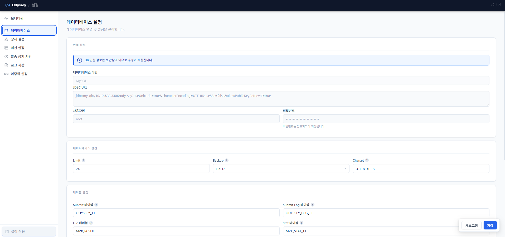

# 20-2. 데이터베이스 설정

DB 연결 정보를 확인하고 옵션을 변경할 수 있습니다. YAML의 <mark style="color:red;">`spring.datasource.hikari`</mark> 항목에 해당합니다.

* **DB 타입**: MariaDB, MySQL, MSSQL, Oracle, PostgreSQL 중 선택
* **JDBC URL / 사용자명**: 보안상 읽기 전용으로 표시됩니다 (YAML에서 직접 수정)
* **옵션**: Limit(발송 제한 시간), Backup mode, Charset
* **테이블 설정**: 테이블명 및 관련 옵션

<figure><figcaption>
그림 12. 데이터베이스 설정 — 연결 정보 (DB 타입, JDBC URL, 사용자명)
</figcaption></figure>


JDBC URL과 사용자명/비밀번호는 보안 정책에 따라 Web UI에서 수정할 수 없습니다. 변경이 필요한 경우 YAML 파일을 직접 편집하십시오.

