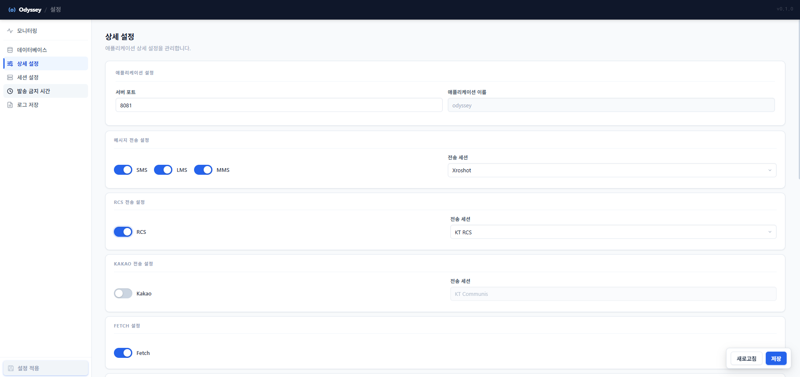
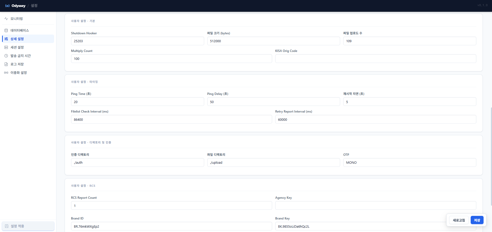

# 20-3. 상세 설정

서비스 사용 여부, 발송 경로, 각종 운영 파라미터를 설정합니다. <mark style="color:red;">**`appliaction.yml`**</mark> 의 <mark style="color:green;">`common.execute`</mark>, <mark style="color:green;">`common.transmission`</mark>, <mark style="color:green;">`common.user`</mark> 항목에 해당합니다.

### **서비스 토글 영역**

* SMS / LMS / MMS 사용 여부 (ON/OFF 토글)
* 발송 경로 선택 (KT 크로샷 / CPaaS)
* RCS / 카카오 발송 사용 여부
* Fetch 사용 여부

<figure><figcaption>
그림 13. 상세 설정 — 애플리케이션 설정, 메시지 전송 토글, RCS/Kakao 전송 설정
</figcaption></figure>

### **사용자 옵션 영역**

* 기본 설정: 파일 크기 제한, 업로드 한도, 멀티플라이어 카운트
* 타이밍 설정: ping time, ping delay, restart delay
* 디렉토리 / 인증: auth dir, file dir, OTP
* RCS 설정: 파일 YN, 자동 업로드, 리포트 카운트, 캐싱
* 기타: KISA 코드, 대행사 KEY / 브랜드 ID, RCS 통계 사용 여부

<figure><figcaption>
그림 14. 사용자 설정 — 타이밍, 디렉토리/인증, RCS 옵션
</figcaption></figure>


설정 변경 후 "저장" 버튼을 클릭하면 사이드바에 변경 내역이 표시됩니다. 최종적으로 사이드바 하단의 **"설정 적용"** 버튼을 눌러야 Odyssey에 반영됩니다.

