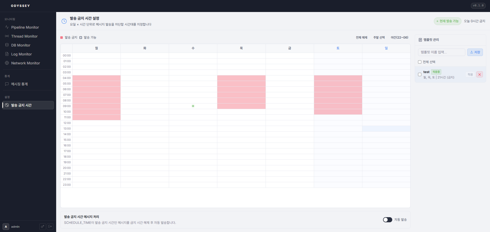

# 20-2. 발송 금지 시간

요일 별·시간대 별 발송 차단 스케줄을 시각적으로 설정합니다.

* **시간 그리드**: 7일(월\~일) × 24시간 격자를 **드래그**하여 차단 시간대를 선택합니다.
* **우클릭**: 연결된 차단 블록을 한번에 해제합니다.
* **템플릿**: 자주 사용하는 차단 패턴을 저장 / 불러오기 / 삭제 할 수 있습니다.

<figure><figcaption>
그림 19. 발송 금지 시간 설정 — 요일×시간 그리드 + 템플릿 관리
</figcaption></figure>


설정 값은 <mark style="color:red;">**`appliaction.yml`**</mark> 이 아닌 **`PAUSE_INFO`** 테이블에 저장됩니다. 광고성 메시지는 정보통신망법에 따라 야간(21:00\~08:00) 발송이 금지되어 있으므로 해당 시간대를 차단 설정해야 합니다.

