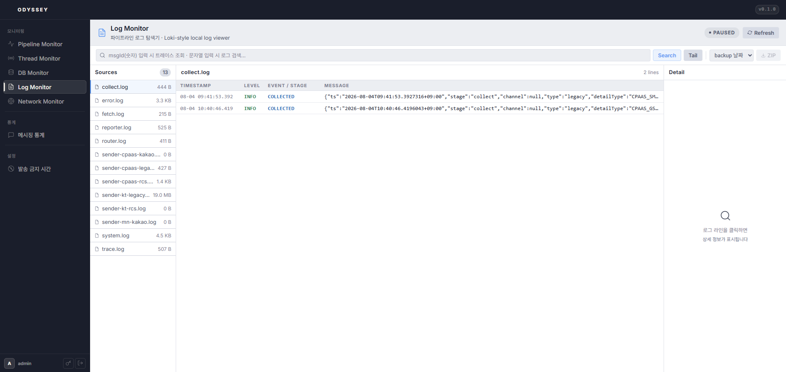

# 20-3. 로그 관리

Odyssey 로그 파일을 브라우저에서 조회하고 다운로드할 수 있습니다.

* **날짜 필터**: 시작일\~종료일 범위로 로그 파일을 필터링합니다.
* **파일 브라우저**: **`log/`** 폴더와 **`log_backup/`** 폴더를 아코디언 형태로 탐색합니다.
* **다운로드**: 개별 파일 다운로드, 전체 ZIP 다운로드, 선택 파일 ZIP 다운로드를 지원합니다.

<figure><figcaption>
그림 16. 로그 관리 — 날짜 필터, log/log_backup 디렉토리 탐색, 파일 선택 다운로드
</figcaption></figure>
